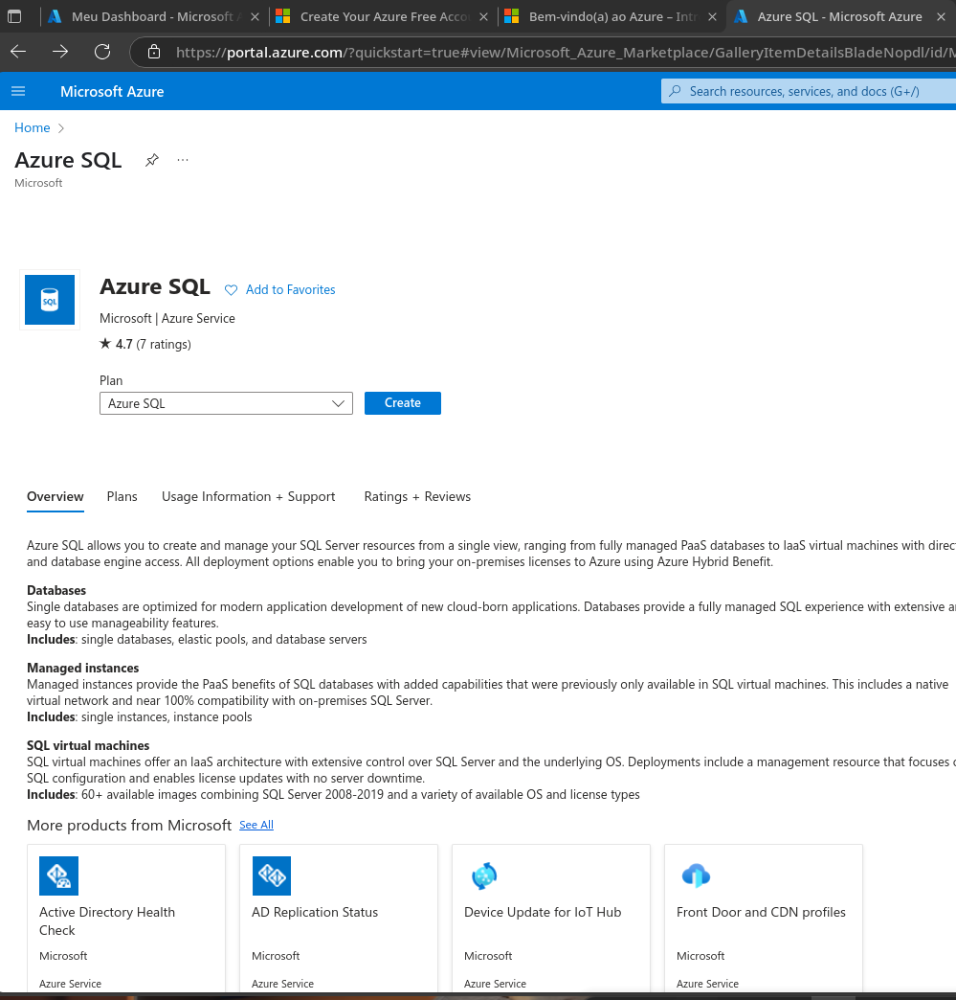
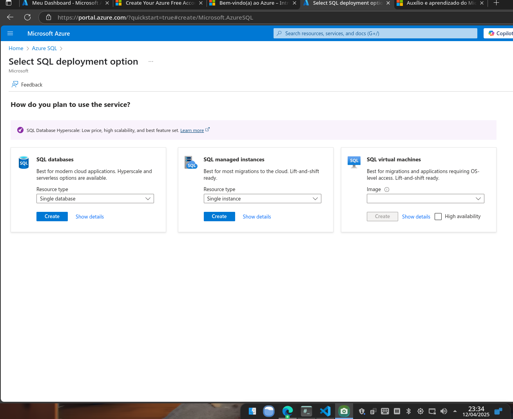
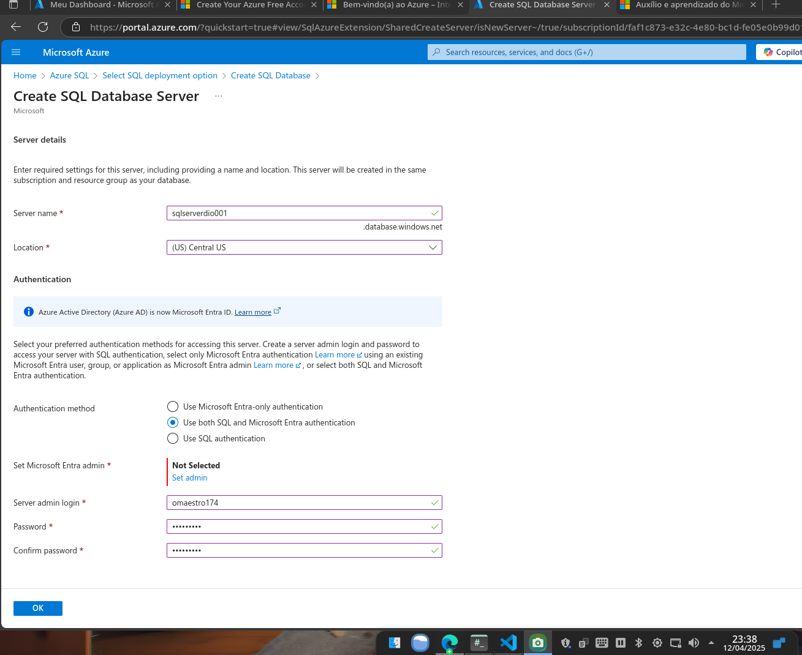
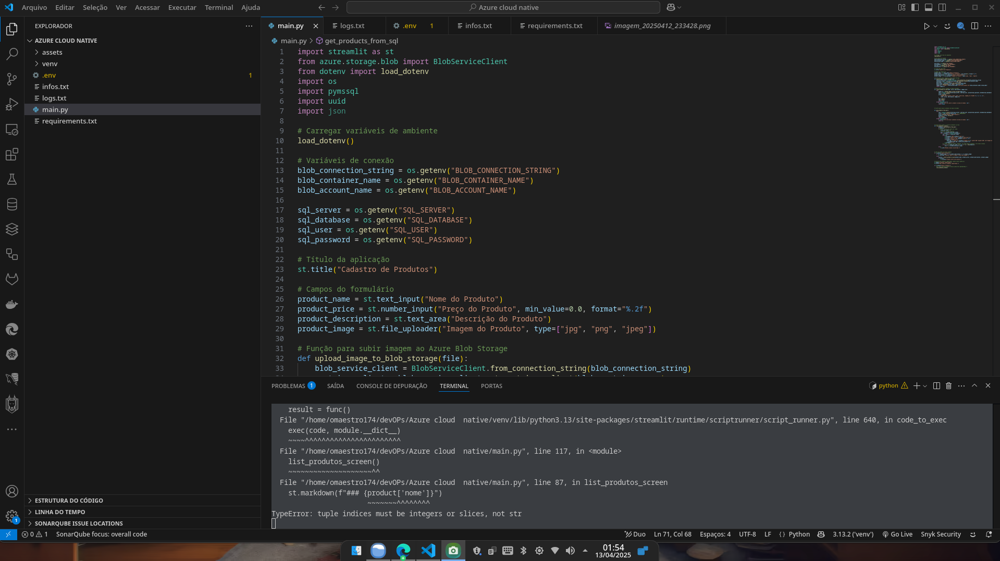
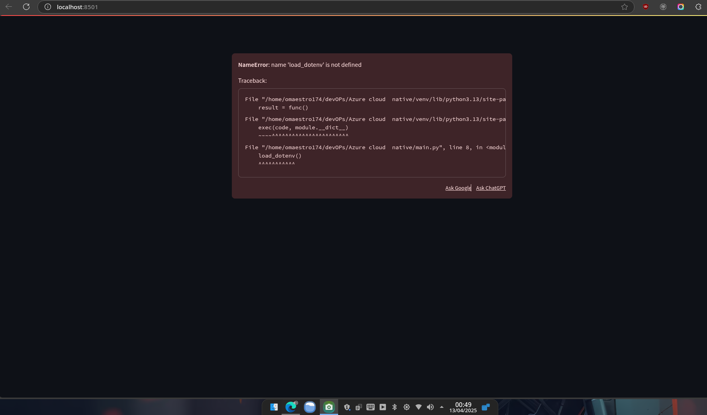
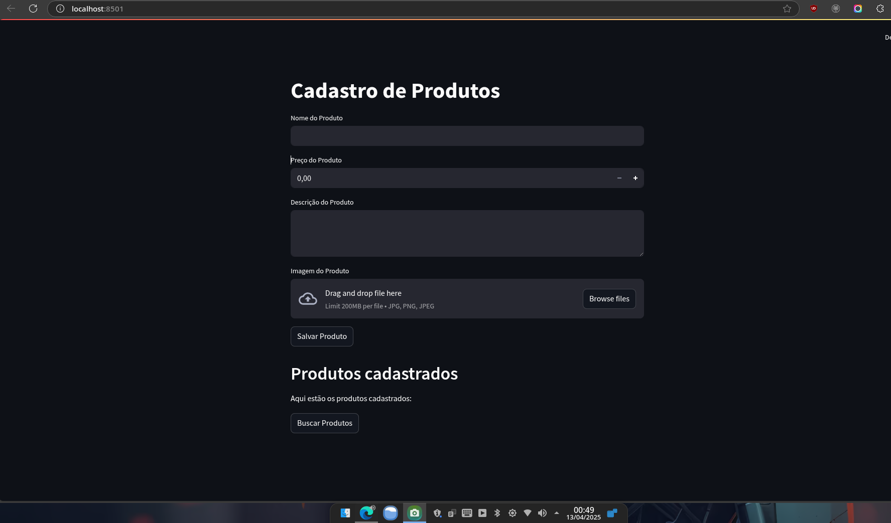
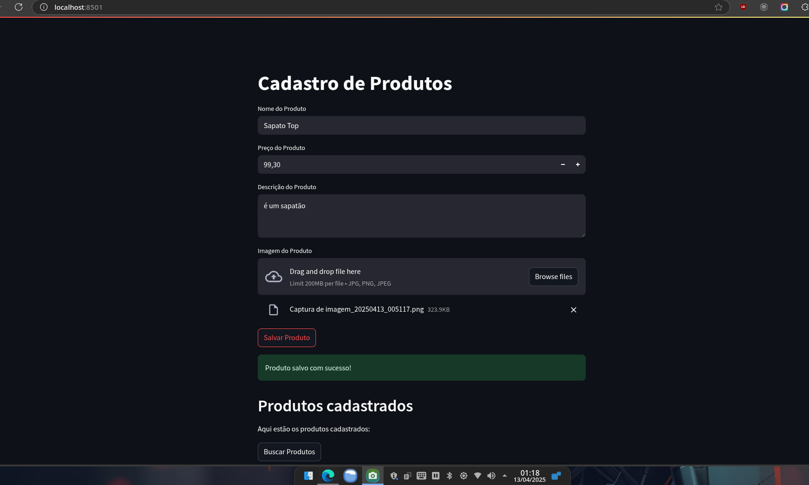
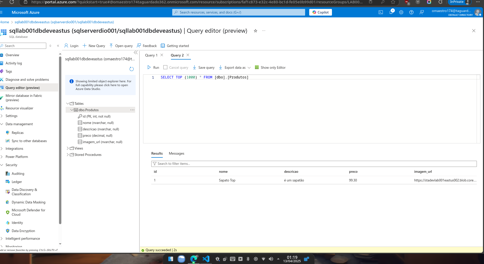
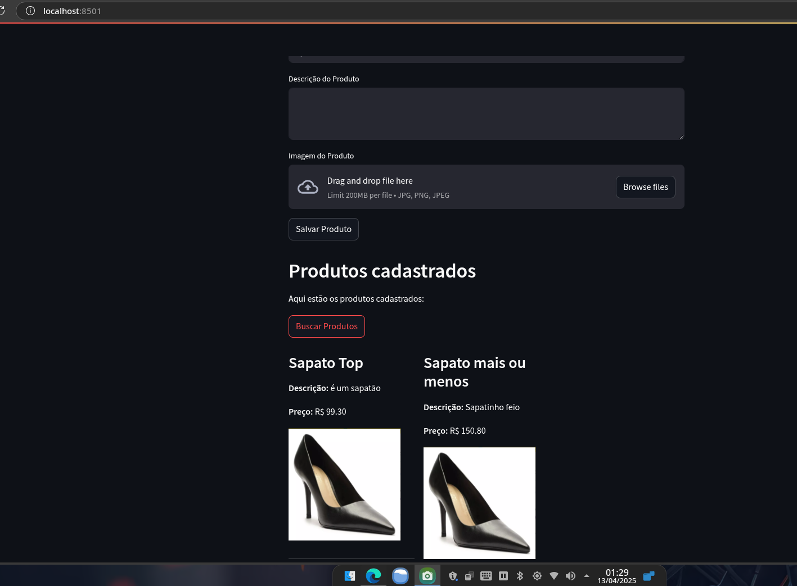
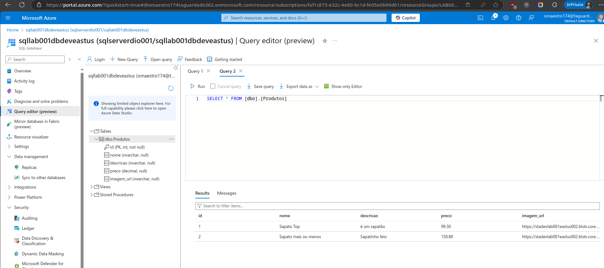

# 🛍️ Cadastro de Produtos com Streamlit + Azure Blob Storage + SQL Server

Este projeto é uma aplicação web simples, desenvolvida com **Streamlit**, que permite cadastrar produtos com **nome**, **preço**, **descrição** e **imagem**. Os dados são salvos em um banco **SQL Server** e as imagens são armazenadas no **Azure Blob Storage**.

---

## 🚀 Funcionalidades

- 📥 Upload de imagem para o Azure Blob Storage
- 🗃️ Cadastro de produtos no SQL Server
- 🖼️ Exibição dos produtos cadastrados com imagem, nome, descrição e preço
- 🌐 Interface simples e elegante com Streamlit

---

## 🧰 Tecnologias e Bibliotecas

- Python 3.13
- Streamlit
- Azure Storage Blob SDK
- Python Dotenv
- PyMSSQL
- UUID
- SQL Server

---

## 📦 Instalação

### 1. Clone o repositório

```bash
git clone https://github.com/oMaestro174/azure-cloud-native-lab001.git
cd azure-cloud-native-lab001
```
## Crie um ambiente virtual

```bash
python -m venv venv
source venv/bin/activate  # ou .\venv\Scripts\activate no Windows
```
## Instale as dependências

```bash
pip install -r requirements.txt
```
## ⚙️ Variáveis de Ambiente
Crie um arquivo .env na raiz do projeto com as seguintes chaves:

```env

BLOB_CONNECTION_STRING=...
BLOB_CONTAINER_NAME=...
BLOB_ACCOUNT_NAME=...

SQL_SERVER=seu-servidor.database.windows.net
SQL_DATABASE=nome-do-banco
SQL_USER=usuario
SQL_PASSWORD=senha

```

## 🧪 Executando o Projeto
```bash
streamlit run main.py
```

## 🛠️ Estrutura da Tabela no SQL Server
```sql
CREATE TABLE Produtos (
    id INT IDENTITY(1,1) PRIMARY KEY,
    nome VARCHAR(255),
    preco DECIMAL(10,2),
    descricao TEXT,
    imagem_url VARCHAR(1000)
);

```

## 🐞 Dificuldades Encontradas
Durante o desenvolvimento, foram enfrentados alguns desafios técnicos:

❌ Erro externally-managed-environment no Arch Linux, resolvido com uso de venv.

🔍 Falha na importação do módulo jason (erro de digitação, o correto era json).

⚠️ ModuleNotFoundError ao usar load_dotenv() antes do import.

🗄️ Erro Invalid object name 'Products': a tabela não existia no banco, foi necessário criar.

❗ Erro ao acessar product['nome']: o cursor.fetchall() retornava tuplas e não dicionários. Resolvido com cursor = conn.cursor(as_dict=True).


## ✨ Melhorias Futuras

✅ Filtros e ordenação de produtos

✅ Validação mais robusta dos campos

☁️ Deploy automático no Azure

🛡️ Autenticação de usuários


## 📸 Telas da aplicação e procedimentos

### Selecionando o Azure SQL


### Selecionando a opção single database


### Criando a base de dados


### Iniciando a Codificação


### Opa! algo de errado não está certo1


### Ele vive!


### Cadastrando primeiro produto


### Quando vi ele estava lá


### Listando o que temos


### Lá de novo e outra vez



